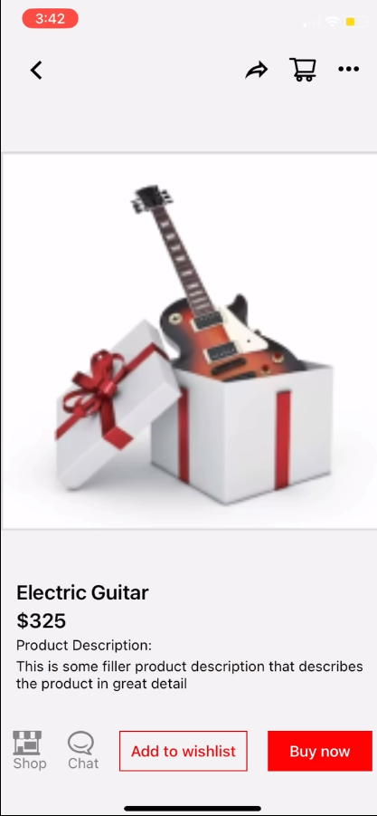
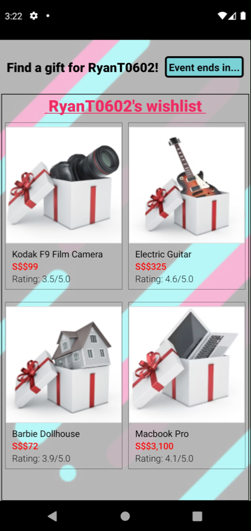

# TikTok_Hackathon
In the realm of traditional gift exchanges, we frequently find ourselves grappling with the challenge of selecting the perfect gift, leaving us uncertain or lacking a personal touch. Moreover, the events tied to exchanging gifts often fall short in terms of engagement, making the whole process feel rather lackluster. With the introduction of a Secret Gift Exchange platform, it aims to inject a breath of fresh air into this age-old tradition. By ingeniously merging TikTok's shop interface with the process of gift-giving, it forms a delightful fusion of social media and e-commerce, guaranteeing an experience that is both entertaining and highly functional. This innovative platform seeks to tackle these issues head-on by introducing an array of features that not only enrich the gift-giving journey but also infuse it with excitement, personalization, and unparalleled convenience, all while maintaining an element of delightful surprise.

## Wishlist Creation and Access
Integrating TikTok's shop interface makes creating wishlists engaging and convenient for participants, adding a unique shopping dimension. Additionally, allowing gifters to access giftees' wishlists streamlines the gift selection process, ensuring recipients receive items they genuinely desire, adding to the platform's functionality.

## Anonymous Interaction
The anonymous chat feature fosters mystery and intrigue, allowing participants to communicate without revealing their identities, making the gifting process more interactive and enjoyable.

## Unboxing and Showcasing
Encouraging user-generated unboxing videos and hashtag promotion transforms the event into a multimedia experience, creating lasting memories for participants and distinguishing it in the realm of gift exchanges.

## Virtual Currency Rewards
By offering virtual currency rewards, the platform incentivizes active participation, introducing a gamified element that sets it apart from traditional gift exchanges, enhancing its appeal.

## Themed Event Challenges
Incorporating themed challenges injects creativity and anticipation into the event, making it more than just gift-giving but a memorable and engaging experience.

